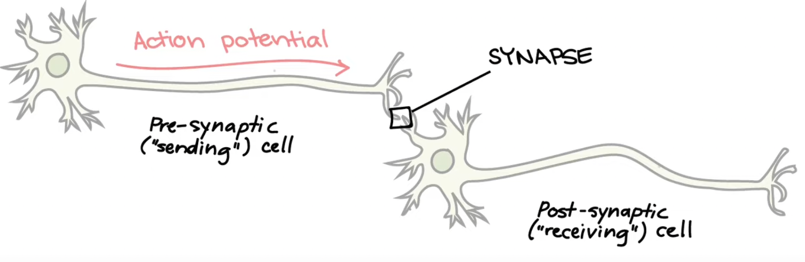
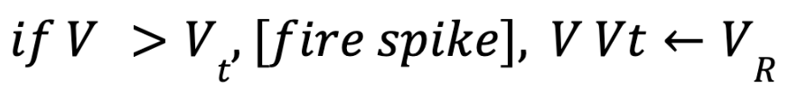
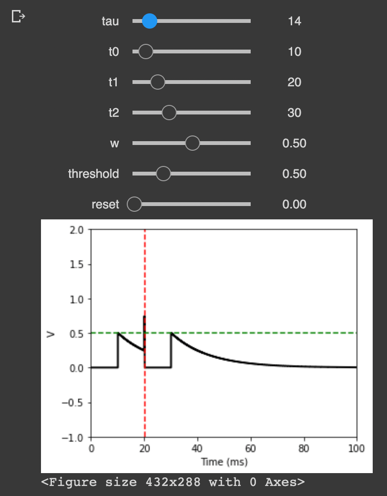
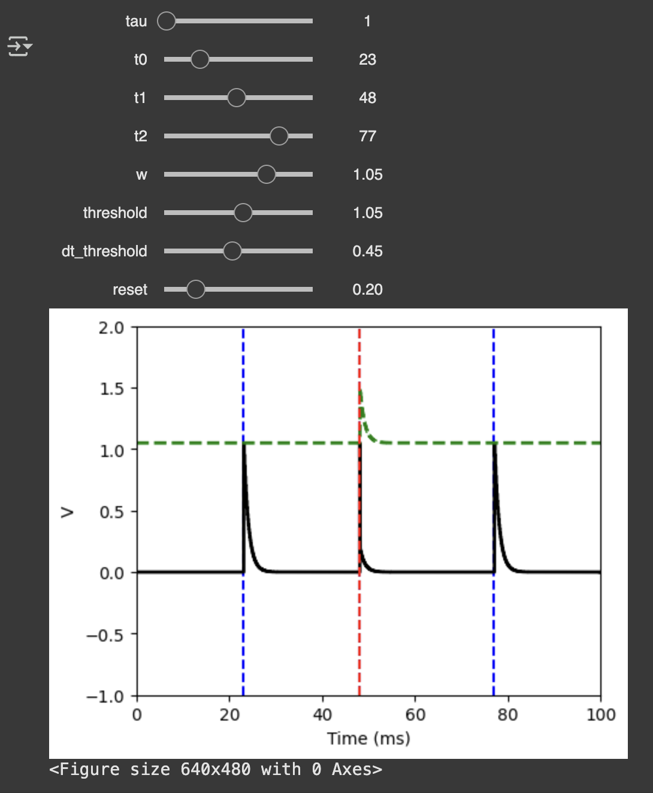

# Simulating Leaky Integrate and Fire (LIF) Neurons

  

In biological neurons, an electrical action potential originates in the cell body and propagates along the axon of the presynaptic neuron, ultimately transmitting a signal to the postsynaptic neuron across a synapse. These action potentials appear as discrete spikes. To visualize this spiking behavior, I simulated the membrane potential over time. The neuron’s activity is modeled mathematically using the Leaky Integrate-and-Fire (LIF) model, characterized by the following parameters:
* resting potential
* reset voltage
* firing threshold
* membrane resistance
* membrane time-scale
* absolute refractory period

LIF artificially reconstructs how neurons fire across a membrane threshold, creating spikes (or action potentials) that then serve as neural (network!) signals.

## 1D LIF SIMULATION
Models a single neuron’s membrane potential V over time. If voltage V is greater than the firing threshold Vt, fire a spike, and reset.

  

* V = membrane potential
* tau = time constant (how quickly the neuron integrates inputs)
* t0, t1, t2: = spike times
* w = synaptic weight (neuron receives a spike, V increases by w)
* Vt = firing threshold

  

## 2D LIF SIMULATION
Models neurons arranged in a two-dimensional grid. At each time step, if `V i,j > Vt i,j` then `neuron (i, j)` fires a spike, resets its membrane potential, and updates its threshold dynamically. Membrane potentials also decay exponentially and integrate inputs from neighbors.

* `V i,j` = membrane potential of neuron at position (i, j)
* tau = time constant
* input spikes = external inputs to neurons, possibly different for each neuron
* w = synaptic weights (influence from neighboring neurons’ spikes)
* `Vt i,j` = dynamic firing threshold

  

For a comprehensive overview of the simulation code and its logic, please refer to the .ipynb notebook files in this repository, which include detailed inline documentation.

*Theory courtesy Dan Goodman, COSYNE 2022*
